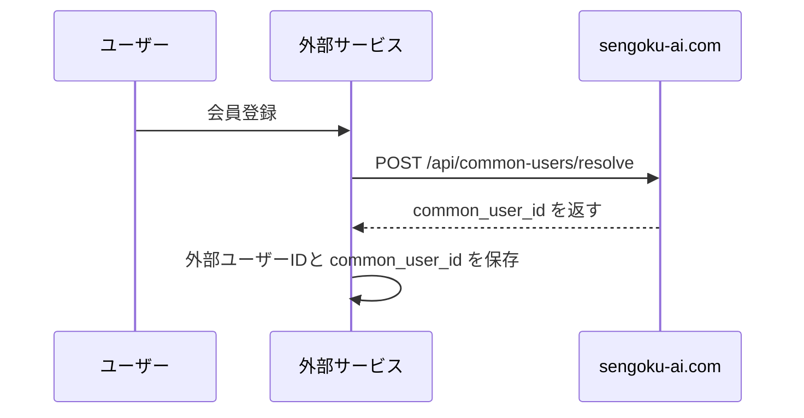
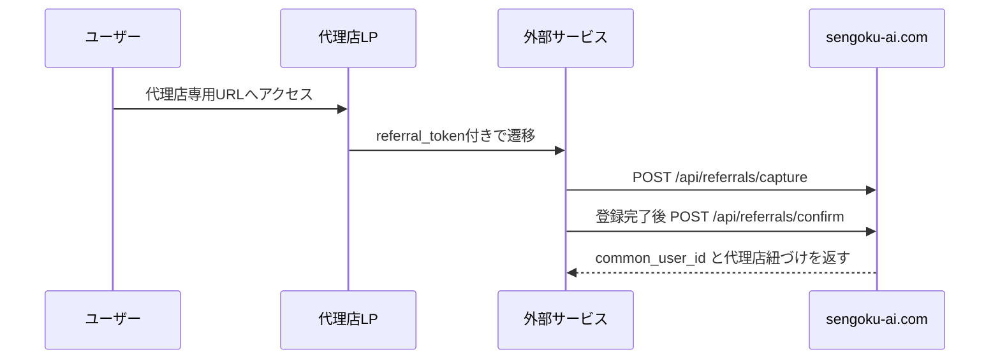
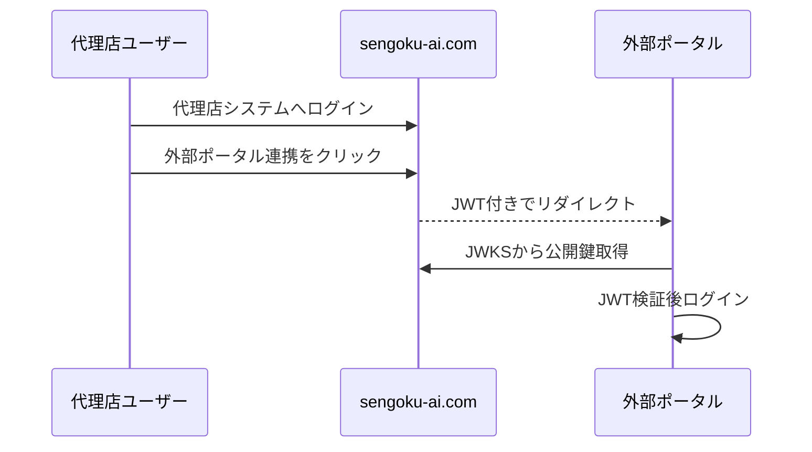

# 千ノ国 代理店システム 外部開発者向け連携ガイド

Version: 3.6.78-draft  
対象システム: `sengoku-ai.com` 代理店システム  
対象読者: 戦国パスポート、ショッピングカート、戦国楽市楽座、ガチャ、その他外部サービスの開発担当者

## 1. この連携の目的

`sengoku-ai.com` の代理店システムを、代理店構造・紹介元・共通顧客IDの中心HUBとして扱います。

外部サービス側でユーザー登録、購入、ログイン、紹介経由の流入が発生した場合でも、以下を追跡できる状態にします。

- どのユーザーが同一人物か
- どの外部サービスのユーザーIDと紐づいているか
- どの代理店、どのプロジェクト、どの紹介URLから来たか
- 上位代理店が下位代理店や顧客の活動状況を把握できるか
- 代理店システムから外部ポータルへSSOログインできるか

## 2. 用語

| 用語 | 意味 |
|---|---|
| 代理店システム | `sengoku-ai.com`。代理店階層、LP、紹介URL、共通顧客HUBを管理する中心システム |
| 外部サービス | 戦国パスポート、ショッピングカート、ガチャ、戦国楽市楽座など |
| 連携先サイト | 代理店システムの管理画面「外部API連携」に登録する外部サービス |
| `agent_code` / `code` | 代理店の公開識別子。外部連携では代理店識別に使う |
| `common_user_id` | 複数サービスを横断して同一人物を表す共通顧客ID |
| `system_key` / `service_key` | 外部サービスを識別するキー。例: `sengoku-passport`, `sengoku-rr`, `cart` |
| `external_user_id` / `service_user_id` | 外部サービス側のユーザーID |
| `referral_token` | 代理店・プロジェクト・紹介ポジションを識別する紹介トークン |

## 3. APIキーは2種類あります

外部連携では、通信方向ごとにAPIキーを分けます。

| 種類 | 発行元 | 保存先 | 用途 |
|---|---|---|---|
| AI受信用APIキー | 代理店システム | 外部サービス側に渡す | 外部サービスから `sengoku-ai.com` へPOST/GETする時に使う |
| 外部サービス受信用APIキー | 外部サービス側 | 代理店システムの「外部API連携」に登録 | `sengoku-ai.com` から外部サービスへPOSTする時に使う |

つまり、連携先ごとに最低2つのキーがあります。

### 3.1 外部サービスから代理店システムへ送る場合

外部サービスは、代理店システムが発行した「AI受信用APIキー」を使います。

```http
x-api-key: {AI受信用APIキー}
```

または:

```http
Authorization: Bearer {AI受信用APIキー}
```

このキーは `external_partner_sites.inbound_api_key` に保存されています。

### 3.2 代理店システムから外部サービスへ送る場合

代理店システムは、外部サービスが発行した「外部サービス受信用APIキー」を使います。

```http
x-api-key: {外部サービス受信用APIキー}
Authorization: Bearer {外部サービス受信用APIキー}
```

このキーは `external_partner_sites.api_key` に保存されています。

## 4. 代理店の一意識別子

外部連携では、代理店の一意識別子として `agent_code` を使ってください。

| 項目 | 外部連携で使うか | 理由 |
|---|---:|---|
| `agent_code` / `code` | 使う | URLや外部連携で使う公開識別子 |
| `id` | 原則使わない | DB内部IDのため、移行や再構築で変わる可能性がある |
| LP URLのパス | 使わない | 表示・ルーティング用途であり、主キーではない |

外部サービス側で代理店を保持する場合は、`agent_code` を外部キーとして保存してください。

## 5. 推奨する基本フロー

### 5.1 外部サービスで新規ユーザー登録された場合



外部サービス側では、登録完了時に `service_key` と `service_user_id` を代理店システムへ送信します。代理店システムは既存人物の候補を検索し、なければ `common_user_id` を新規発行します。

### 5.2 代理店LP・紹介URLから外部サービスへ流入した場合



`capture` は流入記録、`confirm` は登録・購入・申込など成果確定時に使います。

### 5.3 代理店システムから外部ポータルへSSOログインする場合



SSOは、代理店システムへログイン済みの代理店ユーザーが外部ポータルへ移動するための仕組みです。

## 6. 認証共通仕様

### 6.1 API認証ヘッダー

すべての外部向けAPIは、以下のどちらかで認証します。

```http
x-api-key: {APIキー}
```

```http
Authorization: Bearer {APIキー}
```

### 6.2 冪等性キー

POST系APIでは、可能であれば `Idempotency-Key` を付けてください。

```http
Idempotency-Key: uuid-or-unique-request-id
```

同じキーのリクエストは、24時間以内であれば保存済みレスポンスを返します。

## 7. 代理店階層取得API

外部サービスが、代理店階層やLP URLを取得するAPIです。

```http
GET https://sengoku-ai.com/api/hierarchy.php
```

### 7.1 クエリパラメータ

| パラメータ | 必須 | 説明 |
|---|---:|---|
| `format` | 任意 | `tree` または `flat`。省略時は `tree` |
| `root_code` | 任意 | 指定代理店以下だけ取得 |
| `include_inactive` | 任意 | `1` の場合、停止中代理店も含める |
| `include_contact` | 任意 | `1` の場合、メール・電話・LINE URLを含める |
| `include_sso` | 任意 | `1` の場合、SSO起動URLを含める |

### 7.2 リクエスト例

```bash
curl -H "Authorization: Bearer ${AI_INBOUND_API_KEY}" \
  "https://sengoku-ai.com/api/hierarchy.php?format=tree&include_contact=1&include_sso=1"
```

### 7.3 レスポンス例

```json
{
  "ok": true,
  "generated_at": "2026-07-20T18:00:00+09:00",
  "format": "tree",
  "filters": {
    "root_code": null,
    "include_inactive": false,
    "include_contact": true,
    "include_sso": true
  },
  "labels": {
    "level1": "アドバイザー",
    "level2": "ディレクター",
    "level3": "エージェント",
    "positions": {
      "advisor": "アドバイザー",
      "super_advisor": "スーパーアドバイザー",
      "influencer": "インフルエンサー"
    }
  },
  "projects": [
    {
      "id": 1,
      "slug": "sengoku-influencer",
      "name": "戦国インフルエンサー",
      "status": "active",
      "sort_order": 10
    }
  ],
  "count": 2,
  "data": [
    {
      "id": 10,
      "code": "agent001",
      "name": "エージェントA",
      "person_name": "山田 太郎",
      "level": 3,
      "role_label": "エージェント",
      "parent_id": null,
      "parent_code": null,
      "status": "active",
      "lp_urls": [
        {
          "project_id": 1,
          "project_slug": "sengoku-influencer",
          "project_name": "戦国インフルエンサー",
          "url": "https://sengoku-ai.com/a/agent001?project=sengoku-influencer"
        }
      ],
      "contact": {
        "email": "agent@example.com",
        "phone": "09000000000",
        "line_url": "https://lin.ee/example"
      },
      "sso_urls": [
        {
          "client_key": "sengoku-rr",
          "client_name": "sengoku-rr.com",
          "audience": "sengoku-rr",
          "url": "https://sengoku-ai.com/agent/sso_launch.php?client=sengoku-rr"
        }
      ],
      "children": [
        {
          "id": 20,
          "code": "dir001",
          "name": "ディレクターB",
          "person_name": "佐藤 花子",
          "level": 2,
          "role_label": "ディレクター",
          "parent_id": 10,
          "parent_code": "agent001",
          "status": "active",
          "lp_urls": []
        }
      ]
    }
  ]
}
```

## 8. 代理店同期API

外部サービスから代理店システムへ代理店情報を登録・更新するAPIです。

```http
POST https://sengoku-ai.com/api/integrations/agencies
GET  https://sengoku-ai.com/api/integrations/agencies
GET  https://sengoku-ai.com/api/integrations/agencies/{external_id}
```

### 8.1 POSTリクエスト例

```json
{
  "external_id": "rr-agent-001",
  "parent_external_id": "rr-parent-001",
  "name": "外部側代理店名",
  "contact_name": "担当者名",
  "contact_email": "contact@example.com",
  "login_email": "login@example.com",
  "phone": "09000000000",
  "status": "active",
  "default_commission_rate": 10
}
```

### 8.2 メール項目の扱い

`contact_email` と `login_email` は別項目です。

- `contact_email`: 連絡先メール
- `login_email`: ポータルログイン用メール

両方指定された場合でも、片方でもう片方を上書きしません。

## 9. 共通顧客ID API

外部サービスのユーザーIDを `common_user_id` に紐づけるためのAPIです。

### 9.1 共通顧客IDの解決・作成

```http
POST https://sengoku-ai.com/api/common-users/resolve
```

リクエスト例:

```json
{
  "system_key": "sengoku-passport",
  "external_user_id": "passport-user-123",
  "email": "user@example.com",
  "phone": "09000000000",
  "wallet_address": "0x0000000000000000000000000000000000000000",
  "display_name": "ユーザー名",
  "create_if_missing": true,
  "metadata": {
    "registered_from": "passport"
  }
}
```

レスポンス例:

```json
{
  "ok": true,
  "common_user_id": "cu_9f2c0f2e7a8b4d5a9b1c2d3e4f5a6b7c",
  "created": true,
  "matched_by": "created",
  "common_user": {
    "common_user_id": "cu_9f2c0f2e7a8b4d5a9b1c2d3e4f5a6b7c",
    "status": "active",
    "agent_link_status": null,
    "management_status": null
  },
  "system_links": [],
  "identities": [],
  "agency_relations": []
}
```

### 9.2 共通顧客IDの参照

```http
GET https://sengoku-ai.com/api/common-users/{common_user_id}
```

または:

```http
GET https://sengoku-ai.com/api/common-users?system_key=sengoku-passport&external_user_id=passport-user-123
```

### 9.3 外部サービスIDの追加紐づけ

```http
POST https://sengoku-ai.com/api/common-users/{common_user_id}/system-links
```

リクエスト例:

```json
{
  "system_key": "shopping-cart",
  "external_user_id": "cart-user-789",
  "email": "user@example.com",
  "display_name": "購入者名",
  "status": "active"
}
```

## 10. 紹介・成果連携API

### 10.1 流入記録

```http
POST https://sengoku-ai.com/api/referrals/capture
```

リクエスト例:

```json
{
  "referral_token": "rt_xxxxxxxxxxxxxxxxxxxxxxxxxxxxxxxx",
  "session_key": "rs_xxxxxxxxxxxxxxxxxxxxxxxxxxxxxxxx",
  "system_key": "shopping-cart",
  "external_user_id": "anonymous-or-user-id",
  "landing_url": "https://example.com/product/abc",
  "destination_url": "https://shopping.example.com/register",
  "referrer_url": "https://sengoku-ai.com/a/dir001?project=sengoku-influencer",
  "event_type": "capture",
  "metadata": {
    "campaign": "summer"
  }
}
```

### 10.2 登録・購入・申込の確定

```http
POST https://sengoku-ai.com/api/referrals/confirm
```

リクエスト例:

```json
{
  "session_key": "rs_xxxxxxxxxxxxxxxxxxxxxxxxxxxxxxxx",
  "system_key": "shopping-cart",
  "external_user_id": "cart-user-789",
  "email": "user@example.com",
  "relation_type": "referral",
  "referral_source": "purchase",
  "locked": true,
  "metadata": {
    "order_id": "ORD-10001",
    "amount": 12000
  }
}
```

レスポンス例:

```json
{
  "ok": true,
  "common_user_id": "cu_9f2c0f2e7a8b4d5a9b1c2d3e4f5a6b7c",
  "relation": {
    "common_user_id": "cu_9f2c0f2e7a8b4d5a9b1c2d3e4f5a6b7c",
    "agent_id": 20,
    "project_id": 1,
    "relation_type": "referral",
    "locked": 1,
    "status": "active"
  },
  "agency_relations": []
}
```

## 11. 代理店システムから外部サービスへ送信されるイベント

代理店システムの管理画面「外部API連携」に登録された有効な連携先へ、以下のイベントがPOSTされます。

送信先URLは、管理画面にドメインだけを入れた場合、自動で以下になります。

```text
https://example.com/api/integrations/agencies
```

独自エンドポイントを使う場合は、管理画面にフルURLを入力してください。

### 11.1 主なイベント

| イベント | 発生タイミング |
|---|---|
| `connection_test` | 管理画面の接続テスト |
| `admin_created` | 管理者が代理店を作成 |
| `admin_updated` | 管理者が代理店を更新 |
| `role_updated` | 権限・役割を変更 |
| `approved` | 申請承認 |
| `promoted` | 昇格承認 |
| `deactivated` | 停止 |
| `deleted` | 削除 |
| `lead_created` | LP問い合わせ発生 |
| `common_user.merged` | 共通顧客IDを統合 |
| `common_user.assigned_agent.updated` | 共通顧客の担当代理店を修正 |

### 11.2 共通顧客HUBイベント例

```json
{
  "event": "common_user.merged",
  "entity": "common_user",
  "source": "sengoku-ai",
  "common_user_id": "cu_target",
  "common_user": {
    "common_user_id": "cu_target",
    "status": "active",
    "assigned_agent_id": 20,
    "agent_link_status": "assigned"
  },
  "identities": [
    {
      "identity_type": "email",
      "identity_masked": "u***@example.com",
      "verified": 0,
      "source_system_key": "shopping-cart"
    }
  ],
  "system_links": [
    {
      "system_key": "shopping-cart",
      "external_user_id": "cart-user-789",
      "agent_id": 20,
      "status": "active"
    }
  ],
  "agency_relations": [
    {
      "common_user_id": "cu_target",
      "agent_id": 20,
      "project_id": 1,
      "relation_type": "referral",
      "status": "active",
      "agent_code": "dir001",
      "agent_name": "ディレクターB"
    }
  ],
  "details": {
    "source_common_user_id": "cu_source",
    "target_common_user_id": "cu_target",
    "reason": "manual merge",
    "operated_by_type": "admin"
  },
  "updated_at": "2026-07-20T18:00:00+09:00"
}
```

## 12. SSO仕様

### 12.1 起動URL

代理店システムにログイン済みの代理店ユーザーが、以下URLを開きます。

```http
GET https://sengoku-ai.com/agent/sso_launch.php?client={client_key}
```

例:

```http
GET https://sengoku-ai.com/agent/sso_launch.php?client=sengoku-rr
```

代理店システムはJWTを発行し、連携先のSSO受信URLへリダイレクトします。

```text
https://example.com/agency/sso?token={JWT}
```

### 12.2 署名方式

| 項目 | 値 |
|---|---|
| JWT署名アルゴリズム | `RS256` |
| 鍵方式 | RSA秘密鍵で署名、JWKS公開鍵で検証 |
| 共有シークレット | 使用しない |
| JWKS URL | `https://sengoku-ai.com/api/sso/jwks.php` |
| JWT有効期限 | 発行から60秒 |
| `kid` | JWTヘッダーに含まれる。JWKSの `kid` と照合 |

### 12.3 JWTヘッダー例

```json
{
  "typ": "JWT",
  "alg": "RS256",
  "kid": "sso-20260720180000-abcd1234"
}
```

### 12.4 JWTクレーム

| クレーム | 説明 |
|---|---|
| `iss` | 発行者。通常 `https://sengoku-ai.com` |
| `sub` | 代理店コード。`agent_code` |
| `external_id` | 代理店コード。`agent_code` |
| `aud` | 連携先識別子。例: `sengoku-rr` |
| `iat` | 発行時刻 UNIX time |
| `exp` | 有効期限 UNIX time。発行から60秒 |
| `jti` | JWT一意ID |
| `role_level` | 代理店階層レベル |
| `role_label` | 役割名 |
| `agency_name` | 代理店名 |
| `contact_name` | 担当者名 |
| `contact_email` | 連絡先メール |
| `actor_id` | 操作ユーザーID。現状は `agent_code` |
| `actor_name` | 操作ユーザー名 |
| `actor_email` | 操作ユーザーメール |
| `client_key` | SSO連携先キー |
| `client_name` | SSO連携先名 |
| `return_to` | 任意。外部ポータル内の遷移先パス |

### 12.5 外部サービス側の検証手順

1. `https://sengoku-ai.com/api/sso/jwks.php` からJWKSを取得する
2. JWTヘッダーの `kid` と一致する公開鍵を選ぶ
3. `RS256` 署名を検証する
4. `iss` が想定値か確認する
5. `aud` が自サービス用の値か確認する
6. `exp` が期限切れでないか確認する
7. 必要に応じて `jti` を短時間保存し、リプレイを防止する
8. `sub` または `external_id` の代理店コードで外部サービス側ユーザーを作成・更新・ログインさせる

## 13. エラー形式

代表的なエラー形式:

```json
{
  "ok": false,
  "error": {
    "code": "INVALID_API_KEY",
    "message": "API key is invalid."
  }
}
```

よくあるエラー:

| HTTP | code | 意味 |
|---:|---|---|
| 401 | `API_KEY_REQUIRED` | APIキー未指定 |
| 401 | `INVALID_API_KEY` | APIキー不正 |
| 403 | `FEATURE_DISABLED` | 対象機能が無効 |
| 422 | `VALIDATION_ERROR` | 必須項目不足、不正値 |
| 503 | `COMMON_HUB_SCHEMA_NOT_READY` | DBマイグレーション未適用 |

## 14. 外部サービス側で最低限実装してほしいこと

### 14.1 AIへ送信する処理

- ユーザー登録時: `POST /api/common-users/resolve`
- 紹介URL流入時: `POST /api/referrals/capture`
- 登録・購入・申込完了時: `POST /api/referrals/confirm`
- 代理店階層が必要な時: `GET /api/hierarchy.php`

### 14.2 AIから受け取る処理

外部サービス側に、以下の受信用エンドポイントを用意してください。

```http
POST https://example.com/api/integrations/agencies
```

このエンドポイントでは、少なくとも以下を受け取れるようにしてください。

- 代理店作成・更新・停止イベント
- LP問い合わせイベント `lead_created`
- 共通顧客HUBイベント `common_user.merged`
- 担当代理店変更イベント `common_user.assigned_agent.updated`
- 接続テスト `connection_test`

### 14.3 SSO受信処理

外部サービス側に、SSO受信URLを用意してください。

```http
GET https://example.com/agency/sso?token={JWT}
```

JWTは `RS256` とJWKSで検証してください。

## 15. 接続設定チェックリスト

代理店システム管理画面で行うこと:

- 「外部API連携」に連携先サイトを追加
- サイトキーを設定する。例: `sengoku-passport`
- 送信先URLを設定する。ドメインだけでも可
- 外部サービスが発行した受信用APIキーを登録する
- 代理店システムが発行したAI受信用APIキーを外部サービスへ渡す
- 接続テストを実行する
- 「SSO連携」に連携先サイトを追加
- SSO受信URL、`aud`、サイトキーを設定する
- SSO署名鍵を発行し、JWKS URLを外部サービスへ共有する

外部サービス側で行うこと:

- AI受信用APIキーを保存し、AIへ送信するAPIで使う
- 外部サービス受信用APIキーを発行し、代理店システム管理者へ渡す
- `/api/integrations/agencies` 相当の受信APIを用意する
- `/agency/sso` 相当のSSO受信APIを用意する
- `common_user_id` を自サービスのユーザーIDに保存する
- 代理店コード `agent_code` を代理店外部キーとして保存する

## 16. 運用上の注意

- `common_user_id` は顧客・会員の共通IDです。代理店IDとして使わないでください。
- 代理店の外部キーは `agent_code` を使ってください。
- 個人情報の照合は、代理店システム側ではハッシュ化・マスク化して保持する箇所があります。外部サービスへ不要な個人情報を返す前提にしないでください。
- 外部送信に失敗した場合、代理店システムの `integration_event_logs` に記録され、再送対象になります。
- 本番連携前に、必ず接続テスト、SSO検証、紹介確定テストを行ってください。

